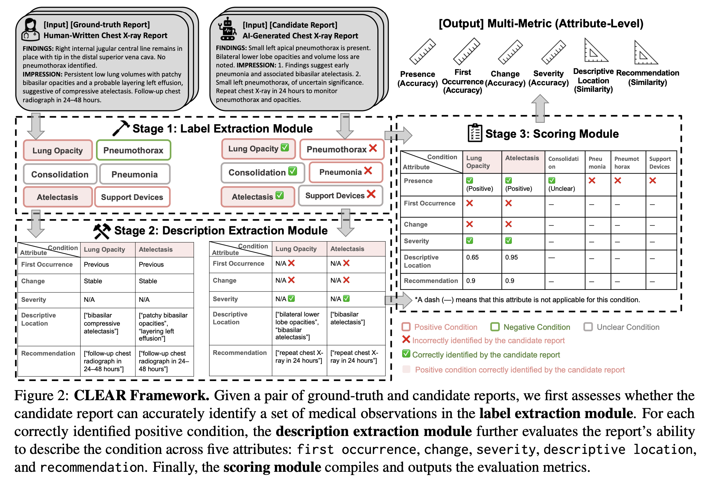

# CLEAR: A Clinically Grounded Tabular Framework for Radiology Report Evaluation

This is the codebase for an end-to-end evaluator for radiology report evaluation based on taxonomy first proposed in [CLEAR](https://arxiv.org/abs/2505.16325) (2025 EMNLP Findings).

## CLEAR Framework


## Codebase Structure
```
.
├── environment.yaml
├── feature
│   ├── configs
│   │   ├── models.py
│   │   └── prompts.py
│   ├── processor
│   │   ├── AzureOpenAI.py
│   │   ├── eval.py
│   │   └── vLLM.py
│   └── run_feature.bash
├── label
│   ├── configs
│   │   ├── models.py
│   │   └── prompts.py
│   ├── processor
│   │   ├── AzureOpenAI.py
│   │   ├── eval.py
│   │   └── vLLM.py
│   └── run_label.bash
├── models
│   ├── README.md
│   └── train
│       └── LLaMA-Factory
├── README.md
└── requirements.txt
```

## Installation

In the main README, we would only demonstrate how to use CLEAR evaluator. If interested in post-training for a specialized local small-size evaluator, please refer /models for more details.

We recommend using conda for environment management. Please run the following command for setting up environment.

```bash
conda env create -f environment.yaml
pip install -r requirements.txt
```

## Component

1. Module 1: Label Extraction Module (5-shot prompting) For scroing, we support Pos F1@13, Pos F1@5, Pos F1 micro and Neg F1@13, Neg F1@5, Neg F1 micro.

2. Module 2: Description Extraction Module (Radiologist-Curated Terminology embedded) We support five features


## Usage

1. Example scripts are available at `./label/run_label.bash` and `./feature/run_feature.bash`. Please use them as templates and adjust the variables to fit your configuration.

2. model name in bash must exist in configs/model.py

3. skip inference by setting SKIP_INFERENCE=True

4. labeling schema in evaluation and dataset using 0 (negative), 1 (postive), -1 (unclear)

5. ensure your input reports has a column named ['report'] containing both FINDINGS and IMPRESSION

6. make sure the model you pass under the vLLM backbone always have temperature, max_tokens, and tensor_parallel_size features

